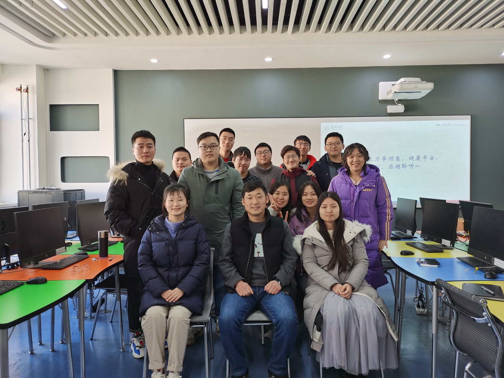

## 协助指导博士研究生

### 2016级

白伸伸 （2020年6月毕业，毕业去向：高校）

### 2018级

雒红升（2023年6月毕业，毕业去向：高校）

### 2019级

方诗雨

***

## 指导硕士研究生

### 2017级

- 王璐 （毕业去向：淘宝）
- 许石金 （毕业去向：美团）
- 刘锐 （毕业去向：部队）

### 2018级

- 单娜 （校级优秀毕业生，毕业去向：美团）
- 刘昱阳 （毕业去向：农行研发中心）
- 王辉 (毕业去向：中电30所)
- 贾二飞（毕业去向：甘肃电力信通公司）

### 2019级

- 胡江龙 （毕业去向：涉密单位）
- 张亚坤 （毕业去向：中物院12所）
- 王杰 （毕业去向：兴业银行）
- 刘盼凤 （毕业去向：上海交大 读博）
- 文艳红 （毕业去向：华中科大 读博）

### 2020级

- 韩雨彤 （毕业去向：民生银行哈尔滨分行）
- 董虎 （毕业去向：甘肃电力信通公司）
- 赵云聪 （毕业去向：中物院12所）
- 孙艺洋 （毕业去向：北航 读博）

### 2021级

- 杨文鑫
- 李银辉
- 田栋文

### 2022级
- 司蕾
- 王徽
- 杨亮

### 2023级
- 李子豪
- 王妮
